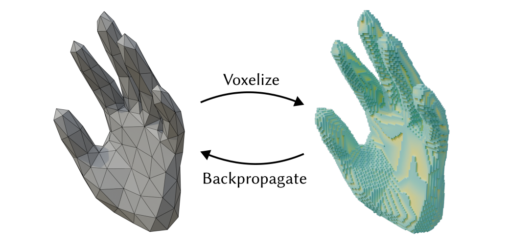

<p align="center">

  <!-- Final URL: https://dl.acm.org/doi/10.1145/3799902.3811203 -->
  <h1 align="center"><a href="https://cybertron.cg.tu-berlin.de/projects/differentiable-voxelization/media/paper.pdf">Differentiable Voxelization of Surface Representations</a></h1>

  <div  align="center">
    <a href="https://dl.acm.org/doi/10.1145/3799902.3811203">
      
    </a>
  </div>

  <p align="center">
    <i>SIGGRAPH 2026 Conference Proceedings</i>
    <br />
    <a href="https://cg.tu-berlin.de/people/tobias-djuren"><strong>Tobias Djuren</strong></a>
    ·
    <a href="https://cg.tu-berlin.de/people/ugo-finnendahl"><strong>Ugo Finnendahl</strong></a>*
    ·
    <a href="https://mworchel.github.io/"><strong>Markus Worchel</strong></a>*
    ·
    <a href="https://cg.tu-berlin.de/people/hendrik-meyer"><strong>Hendrik Meyer</strong></a>
    ·
    <a href="https://cg.tu-berlin.de/people/marc-alexa"><strong>Marc Alexa</strong></a>
  </p>

  <p align="center">
   *Equal contribution (shared second author)
  </p>
</p>

## About

This repository contains the official implementation of the paper "Differentiable Voxelization of Surface Representations".

The algorithms are implement in C++, targeting the CPU (a CUDA GPU implementation is work in progress). The `dvx` package exposes these algorithms to Python, where they are readily usable with PyTorch.
<!-- , NumPy, and [Dr.Jit](https://github.com/mitsuba-renderer/drjit). -->

## Getting Started

The easiest way to install the Python package is via `pip`

```bash
pip install dvx-python
```

### Optional: Test the Installation

To test the installation, run

```bash
pip install numpy pytest svgpathtools trimesh
python -m pytest .\tests -v
```

Some tests may be skipped, depending on the availability of packages.

### Usage

This is a minimal PyTorch example that demonstrates triangle mesh voxelization. For more usage examples, see the [demos](demos) folder.

```python
import dvx.torch as dvx

# Triangle mesh as indexed face set within the [-1,1]^3 cube (v: vertices, f: faces)
v, f = ...
v.requires_grad_(True)

# Resolution of the voxel grid
n = 64 

# Voxelize the mesh -> returns a grid with shape (n,n,n) of smoothed winding numbers
voxels = dvx.voxelize(n, v, f)

loss = some_loss(voxels)
loss.backward() # Gradients are propagated to the mesh vertices v
```

## License and Copyright

The code in this repository is provided under a BSD 3-clause license. 

## Citation

If you use this code or our method in your research, please cite our paper:

```bibtex
@inproceedings{djuren:2026:diffvoxel,
    author = {Djuren, Tobias and Finnendahl, Ugo and Worchel, Markus and Meyer, Hendrik and Alexa, Marc},
    title = {Differentiable Voxelization of Surface Representations},
    year = {2026},
    isbn = {979-8-4007-2554-8/2026/07},
    publisher = {Association for Computing Machinery},
    address = {New York, NY, USA},
    url = {https://doi.org/10.1145/3799902.3811203},
    doi = {10.1145/3799902.3811203},
    booktitle = {Proceedings of the Special Interest Group on Computer Graphics and Interactive Techniques Conference Conference Papers},
    keywords = {differentiable voxelization, efficient voxelization, smoothed winding numbers, shape optimization},
    location = {
    },
    series = {SIGGRAPH Conference Papers '26}
}
```


