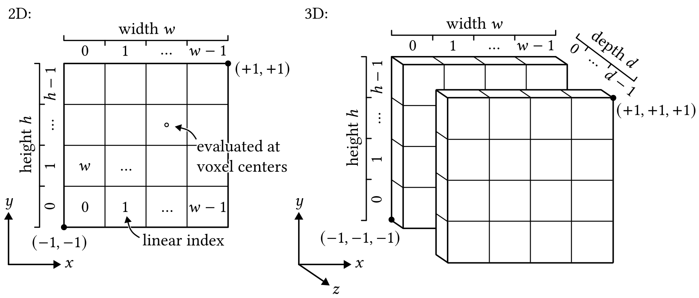

<p align="center">

  <h1 align="center"><a href="https://dl.acm.org/doi/10.1145/3799902.3811203">Differentiable Voxelization of Surface Representations</a></h1>

  <div  align="center">
    <a href="https://dl.acm.org/doi/10.1145/3799902.3811203">
      
    </a>
  </div>

  <p align="center">
    <i>SIGGRAPH 2026 Conference Proceedings</i>
    <br />
    <a href="https://cg.tu-berlin.de/people/tobias-djuren"><strong>Tobias Djuren</strong></a>
    ·
    <a href="https://cg.tu-berlin.de/people/ugo-finnendahl"><strong>Ugo Finnendahl</strong></a>*
    ·
    <a href="https://mworchel.github.io/"><strong>Markus Worchel</strong></a>*
    ·
    <a href="https://cg.tu-berlin.de/people/hendrik-meyer"><strong>Hendrik Meyer</strong></a>
    ·
    <a href="https://cg.tu-berlin.de/people/marc-alexa"><strong>Marc Alexa</strong></a>
  </p>

  <p align="center">
   *Equal contribution (shared second author)
  </p>
</p>

## About

This repository contains the official implementation of the paper "Differentiable Voxelization of Surface Representations", which introduces an efficient method for turning the surface representation of a shape (e.g. a triangle mesh) into a volumetric representation in a differentiable manner. Volumetric objectives, for example, for intersection avoidance, can be easily defined on the resulting voxel grid and drive the optimization of the surface.

The algorithms are implement in C++, targeting the CPU (a CUDA GPU implementation is work in progress). The `dvx` package exposes these algorithms to Python, where they are readily usable with PyTorch.
<!-- , NumPy, and [Dr.Jit](https://github.com/mitsuba-renderer/drjit). -->

## Getting Started

The easiest way to install the Python package is via `pip`

```bash
pip install dvx-python
```

### Optional: Test the Installation

To test the installation, run

```bash
pip install numpy pytest svgpathtools trimesh
python -m pytest ./tests -v
```

Some tests may be skipped, depending on the availability of packages.

### Usage

This is a minimal PyTorch example that demonstrates triangle mesh voxelization in $\mathbb{R}^3$:

```python
import dvx.torch as dvx

# Triangle mesh as indexed face set within the [-1,1]^3 cube (v: vertices, f: faces)
v, f = ...
v.requires_grad_(True)

# Resolution of the voxel grid (same resolution in all dimensions)
n = 64 

# Voxelize the mesh -> returns a grid with shape (n,n,n) of smoothed winding numbers
voxels = dvx.voxelize(n, v, f)

loss = some_loss(voxels)
loss.backward() # Gradients are propagated to the mesh vertices v
```

For more usage examples, see the [demos](demos) folder. The demos include examples for bandsaw cutting, space tilings in $\mathbb{R}^3$ and for self-intersection resolving to generate results similar to the ones in the paper.

## Conventions for Coordinates and Data Layout

The volume considered for voxelization is the $[-1, 1]^d$ cube, where $d$ is the dimensionality of the space. The input shape (e.g., a triangle mesh) must be *fully* contained within this volume, otherwise the output is undefined $\space^1$. 

The voxel grid covers this volume exactly, which means it reaches from $(-1, -1, \ldots, -1) \in \mathbb{R}^d$ to $(1, 1, \ldots, 1) \in \mathbb{R}^d$. We use standard naming conventions to denote points in space: $(x, y)$ for $\mathbb{R}^2$ and $(x, y, z)$ for $\mathbb{R}^3$. 

For two-dimensional input and a resolution of $w$ in x-direction and $h$ in y-direction, the result is an array of shape $(h, w)$. Similarly, for three-dimensional input with the same resolutions in x- and y-directions, and a resolution of $d$ in z-direction, the result is an array of shape $(d, h, w)$. The voxel data is stored in row-major order, i.e., the index in x-direction is the fastest varying, followed by y and z.

The value of a voxel is the smoothed winding number field evaluated at its center. 

The following sketch summarizes our conventions for coordinates and the data layout in $\mathbb{R}^2$ and $\mathbb{R}^3$:

<div  align="center">
    
</div>


$\space^1$ This restriction is not a limitation of the method itself, but rather a consequence of how the closed-form integration is currently implemented. It will be lifted in a future release.

## License and Copyright

The code in this repository is provided under a BSD 3-clause license. 

## Citation

If you use this code or our method in your research, please cite our paper:

```bibtex
@inproceedings{Djuren:2026:DVX,
    author = {Djuren, Tobias and Finnendahl, Ugo and Worchel, Markus and Meyer, Hendrik and Alexa, Marc},
    title = {Differentiable Voxelization of Surface Representations},
    year = {2026},
    isbn = {9798400725548},
    publisher = {Association for Computing Machinery},
    address = {New York, NY, USA},
    url = {https://doi.org/10.1145/3799902.3811203},
    doi = {10.1145/3799902.3811203},
    booktitle = {Proceedings of the Special Interest Group on Computer Graphics and Interactive Techniques Conference Conference Papers},
    articleno = {22},
    numpages = {12},
    keywords = {differentiable voxelization, efficient voxelization, smoothed winding numbers, shape optimization},
    location = {
    },
    series = {SIGGRAPH Conference Papers '26}
}
```


